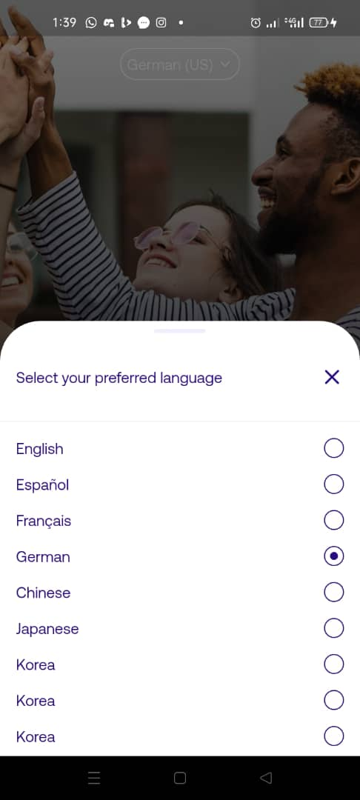
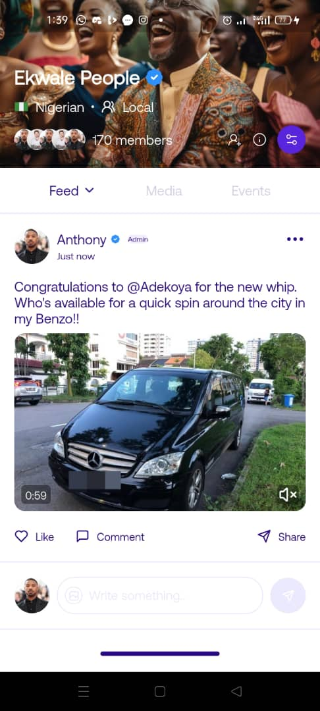
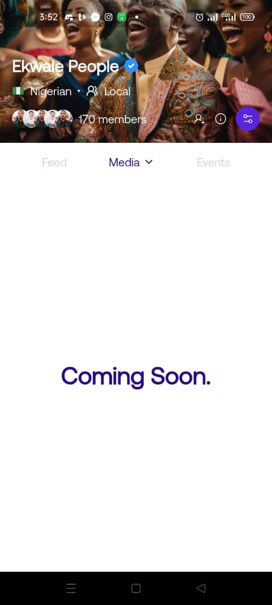

# assessment_app

A Flutter app built for a job assessment. This is a simple app with an onboarding/sign up screen, and another screen called community feed.

## Screenshots

### Onboarding


### Language Selector BottomSheet


### Community Feed Screen




## Tech Stack

- **Framework**: Flutter
- **Framework Version**: Stable(3.32.1)
- **Language**: Dart
- **Language Version**: Dart 3.8.1
- **Architecture**: MVVM (Model-View-ViewModel)
- **UI Components**: Custom Flutter widgets

## Setup & Installation

### Prerequisites
- Flutter SDK (stable version)
- Dart SDK
- Android Studio / VS Code
- iOS Simulator / Android Emulator

### Installation Steps

1. **Clone the repository**
   ```bash
   git clone https://github.com/obialohenry/assessment_app.git
   cd assessment_app
   ```

2. **Install dependencies**
   ```bash
   flutter pub get
   ```

3. **Run the application**
   ```bash
   # For Android
   flutter run

   # For iOS
   flutter run -d ios

  4. **Build for release**
   ```bash
   # Android APK
   flutter build apk --release

   # iOS
   flutter build ios --release
   ```

## Platform Support

- ✅ Android
- ✅ iOS

## Time Spent

- 26 hours and 15 minutes(11:05pm Friday - 1:20am Sunday)

## Contact

Obialor Chisomebi Henry - obilaorchisomebi123@gmail.com

Project Link: [https://github.com/obialohenry/assessment_app](https://github.com/obialohenry/assessment_app)

---